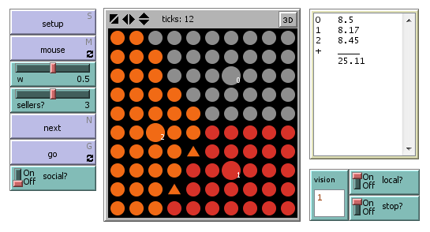
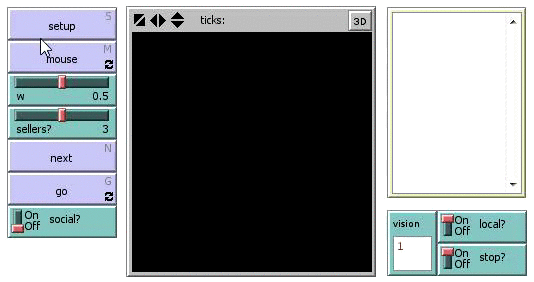

# IceCream #

*Simulation of [Hotelling's law](http://en.wikipedia.org/wiki/Hotelling's_law) in 1 and 2 dimensional space with 2 to 5 vendors*

This model requires [NetLogo 5](https://ccl.northwestern.edu/netlogo/) (free for academic or personal use) to run. Please download NetLogo and open the [ice-cream v14.nlogo](ice-cream v14.nlogo) file using NetLogo.

Economic theory strongly depends on highly stylized models of reality. This is a very simple model in which we try to show how one could go from a purely game-theoretical form of a well known economic problem towards a more practical [Agent-Based Model](http://en.wikipedia.org/wiki/Agent-based_model) simulation equivalent. A simulation such as ours allows for more real-life data to be incoorporated into the original stylized problem and allows for easy solving of the problem op optimal geographic position.

Please visit the [University of Wageningen page on Agent-Based Modelling](http://www.wageningenur.nl/en/Expertise-Services/Chair-groups/Social-Sciences/Agricultural-Economics-and-Rural-Policy-Group/Research/Ice-Cream-Men.htm) for more background information on this model.

*Example run of 3 ice cream vendors in 2D space:*

